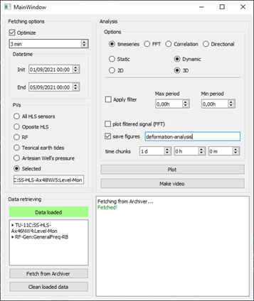

# HLS Data Analyser
Script used to treat and analyze data from the HLS of the Sirius.

Standalone-app points to desktop app with all the functionalities described above, while the notebooks
points to a Jupyter notebook with just a few features, although it can be expanded as needed.

### Current functionaties
1. Load predefined or generic PVs from the Archiver through its API
2. Generate 2D or 3D plots of the HLS sensors data as a "stop motion" visual scheme
3. Make movies with this sequence of images
4. Visualize data in time and frequency domains, apply filter to the original signal(s)
5. Run simple correlation analysis

### Requirements
Python >= 3.7 is recommended, and specific packages are needed.

### Use

To obtain a movie with a 3D plot of HLS data on a specific period of time:
1. On the 'fetching options', select the time period and 'All HLS sensors' for the PV
2. Click 'Fetch from Archiver'
3. On the 'analysis' options, select 'timeseries' + 'dynamic' + '3D'
4. Check the 'save figure' box and enter a ending directory name, e.g. 'hls-analysis-1'
5. Click 'Plot' and wait for all the images to be generated and saved on the output path
6. After that, click on 'Make video'